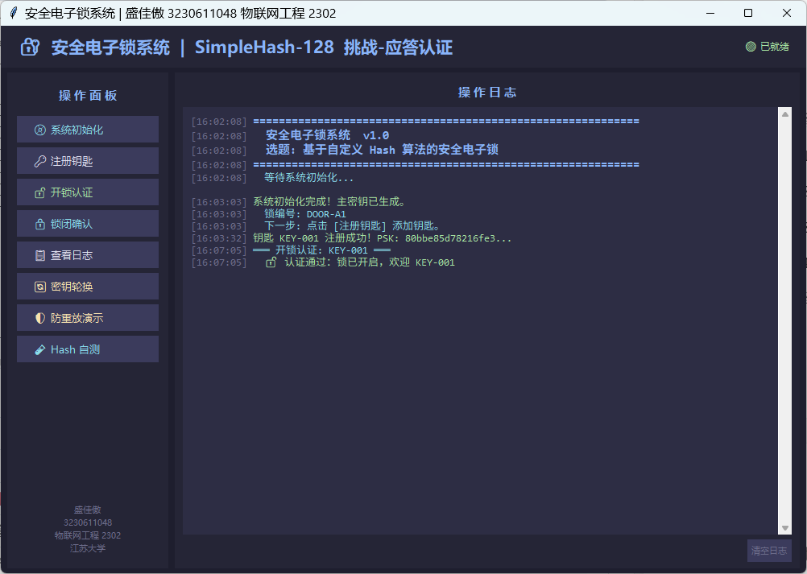
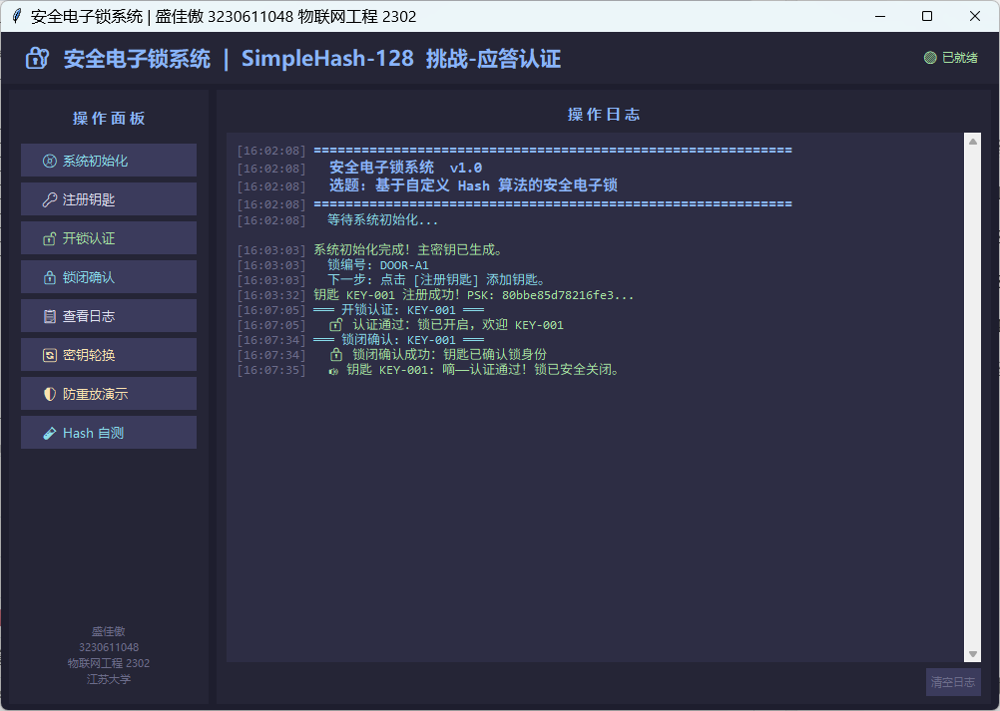
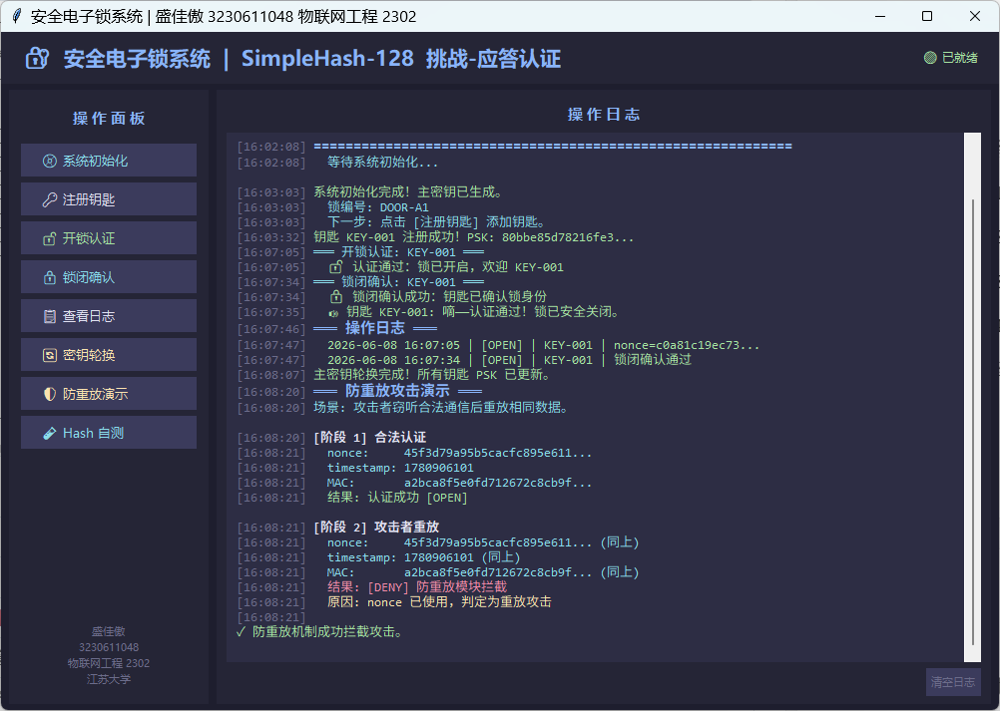

# Simple Electronic Lock 🔐

> 基于自定义哈希算法（SimpleHash-128）的挑战-应答认证电子锁系统  
> 物联网安全技术课程设计 | 江苏大学 物联网工程 2302

---

## 概述

本项目实现了一套完整的**安全电子锁系统**，从零构建密码学原语，实现安全的物理访问控制。系统采用三层架构（密钥服务器 → 电子锁 → 安全钥匙），基于挑战-应答协议实现双向认证。

**无需任何外部依赖**，所有密码学操作均使用 Python 标准库实现。

## 核心特性

| 特性 | 说明 |
|------|------|
| **自定义哈希算法** | SimpleHash-128 — Merkle-Damgård 结构，128-bit 输出，雪崩效应 ~44.5% |
| **挑战-应答认证** | Nonce + 时间戳 → HMAC 应答 → 防重放验证，全流程 ~70μs |
| **双向验证** | 开锁时锁验证钥匙；锁闭时钥匙验证锁身份并发出提示音 |
| **防重放攻击** | Nonce 去重缓存 + 30秒时间窗口双重防御 |
| **分级密钥管理** | 主密钥 → 卡片 PSK 二级派生架构，支持吊销与轮换 |
| **GUI 界面** | 深色主题 Tkinter 可视化操作面板 |
| **零依赖** | 纯 Python 标准库，无第三方包 |

## 快速开始

```bash
git clone https://github.com/garland105/simple-electronic-lock.git
cd simple-electronic-lock

# 启动 GUI 界面
python src/gui.py

# 或启动 CLI 交互模式
python src/access_control.py
```

### 操作流程

```
① 系统初始化 → ② 注册钥匙 → ③ 开锁认证 → ④ 锁闭确认
               ↘ ⑤ 防重放演示 ⑥ Hash 自测
```

## 系统架构

```
┌─────────────────┐      PSK 查询       ┌─────────────────┐
│  密钥管理服务器   │ ◄────────────────── │     电子锁       │
│  KeyServer      │ ──────────────────► │  SecurityLock   │
│  (主密钥/KDF)   │     安全信道         │  (挑战/MAC/防重放)│
└─────────────────┘                     └────────┬────────┘
                                                  │ 挑战-应答
                                                  │ 锁闭确认
                                          ┌───────▼────────┐
                                          │    安全钥匙      │
                                          │  SecurityKey    │
                                          │  (UID+PSK/蜂鸣) │
                                          └────────────────┘
```

## 模块说明

| 模块 | 文件 | 职责 |
|------|------|------|
| **Hash 引擎** | `hash_engine.py` | SimpleHash-128 算法 + MAC 计算 |
| **密钥服务器** | `key_server.py` | 主密钥生成、PSK派生、吊销/轮换管理 |
| **钥匙** | `key.py` | 挑战应答计算、锁身份验证、声音提示 |
| **电子锁** | `lock.py` | 挑战生成、MAC验证、防重放、锁闭确认 |
| **CLI 程序** | `access_control.py` | 命令行交互菜单（9项功能） |
| **GUI 程序** | `gui.py` | Tkinter 深色主题可视化界面 |

## 安全设计

### 密码学原语
- **SimpleHash-128**：自定义简化哈希算法，基于 Merkle-Damgård 迭代结构
- 40 轮压缩（4 阶段非线性函数：Ch/Parity/Maj）
- 雪崩效应测试：1-bit 输入差异 → 约 50% 输出位翻转

### 认证协议
- **挑战-应答**：每次认证生成随机 128-bit Nonce，结合时间戳
- **消息认证码**：MAC = Hash(PSK || UID || Nonce || Timestamp)
- **防重放**：Nonce 去重缓存（最大 1000 条）+ 30 秒时间窗口

### 密钥管理
- 256-bit 主密钥 + HKDF 风格派生 128-bit 卡片 PSK
- 主密钥轮换 + 卡片吊销机制
- 密钥库 Base64 编码 + 完整性哈希校验

## 运行截图

| 开锁认证 | 锁闭确认 | 防重放演示 |
|---------|---------|-----------|
|  |  |  |

## 测试数据

| 测试项 | 结果 |
|--------|------|
| 雪崩效应 | 57/128 bit 翻转 (44.5%) |
| Hash 性能 | ~30,000 ops/s |
| 单次认证全流程 | ~70 μs |
| 锁闭确认流程 | ~100 μs |
| 防重放检测 | ✅ 拦截成功 |

## 项目结构

```
simple-electronic-lock/
├── src/
│   ├── hash_engine.py      # 自定义哈希算法
│   ├── key_server.py       # 密钥管理服务器
│   ├── key.py              # 安全钥匙模块
│   ├── lock.py             # 电子锁模块
│   ├── access_control.py   # CLI 交互主程序
│   └── gui.py              # Tkinter GUI 界面
├── docs/
│   ├── screenshots/        # 运行截图
│   └── diagrams/           # 设计图（架构/算法/协议序列）
├── report/                 # 课程设计报告
├── README.md
└── .gitignore
```

## 课程信息

- **课程**：物联网安全技术
- **选题**：安全电子锁（基于自定义 Hash 算法）
- **作者**：盛佳傲
- **学号**：3230611048
- **班级**：物联网工程 2302
- **学校**：江苏大学

## License

MIT
